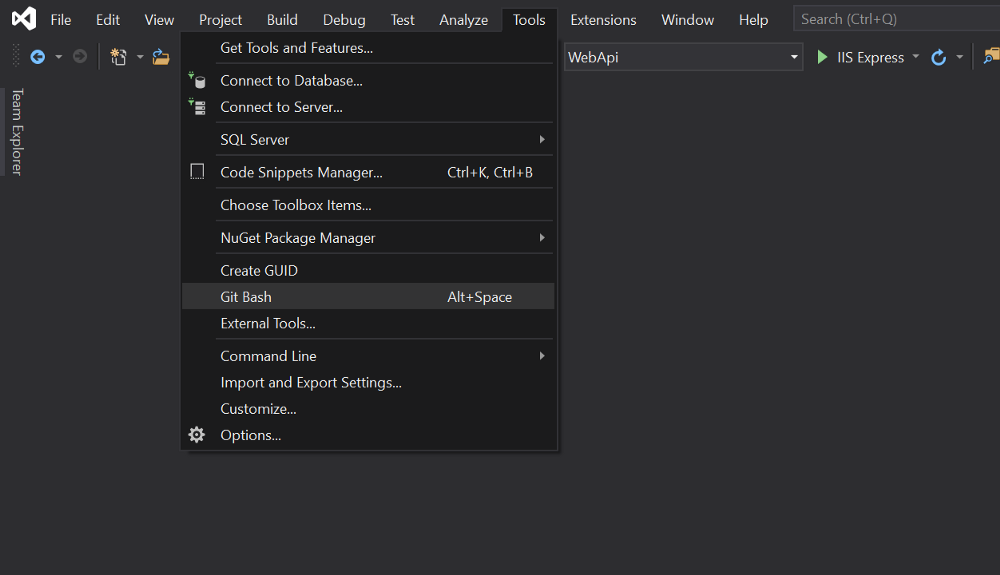

If you’re like me preferring to directly work with the git-bash command-line tool instead of using the Teams Explorer window in the Visual Studio 2019 you probably want to have the git-bash tool be accessible in a second!

1. Make sure you [have Git installed](https://git-scm.com/download/win).
2. Open Visual Studio 2019 and go to Tools > External Tools…
3. Click on the Add button and fill the fields like this:
    * Title: Git Bash
    * Command: `C:\Program Files\Git\git-bash.exe`
    * Arguments:
    * Initial Directory: `$(SolutionDir)` and click on the Ok button.
4. From Tools > Options > Environment > Keyboard, enter `Tools.ExternalCommand2` (If it's your second custom external tool) in the text box under the "Show commands containing" and select it.
5. Then select the text box under “Press Shortcut keys” and press your favorite keys (like Alt+Space) and click on the Assign button and then click OK and you’re done!
Now whenever you want to do any deep dive git thing, just press Ctrl+Space and the git-bash command line will appear immediately!
Have a happy coding!
