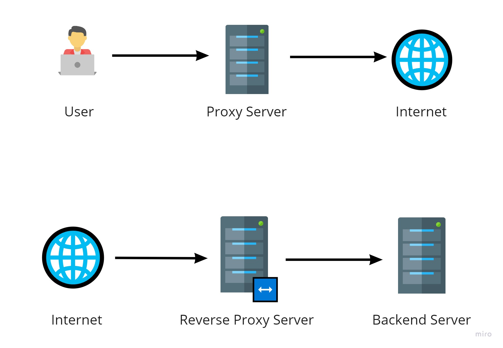
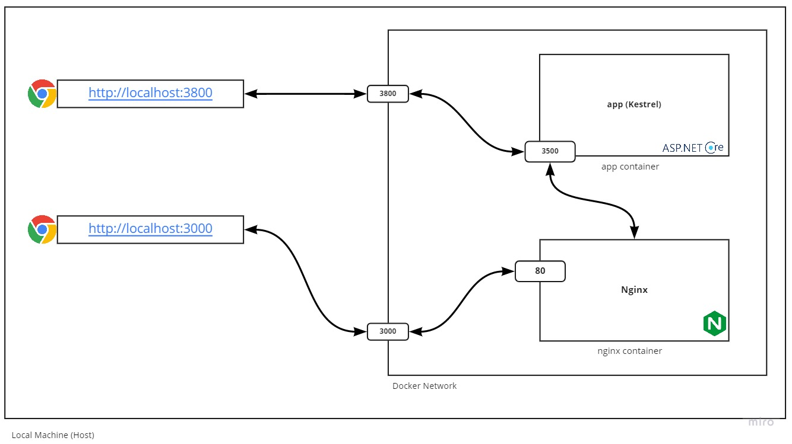

You probably have heard about reverse proxy servers. Your DevOps team may have already configured your company's website to use a reverse proxy server. But what is it exactly?

Well, to answer that, let's see what a proxy server is. A proxy server is a computer program running on a machine that lies between a client and the Internet and provides extra security and anonymity. A reverse proxy server provides the same features for a protected server.


*Proxy Server vs Reverse Proxy Server*

Reverse proxy servers provide the following features:
* Load Balancing - Reverse Proxy Servers can control incoming requests and reroute them to a designated group of servers. Distributing load on multiple servers increases speed and capacity utilization. 

* Web Acceleration - Reverse proxy servers can provide features like compressing request/response data, caching, SSL encryption, etc., and leaving downstream servers free to do what they are supposed to do.

* Security and Anonymity - By sitting in front of the internal network, reverse proxy servers can add another layer of protection against security attacks.

We will have a demonstration for each feature described above but first, let's set up a reverse proxy server on our local machine.

If you're a DotNet Core developer, you probably know that [Kestrel](https://docs.microsoft.com/en-us/aspnet/core/fundamentals/servers/kestrel){:target="_blank"} is a cross-platform web server included and enabled by default in ASP.NET Core apps. [Nginx](https://www.nginx.com/resources/glossary/nginx/){:target="_blank"} is a well-known web server with a rich feature set. In this blog post, we will use Nginx as a reverse proxy web server for the Kestrel and ASP.NET Core.


Let's start with building a simple web application. Create a folder called `reverse-proxy-sample` that contains another folder named `app`:

```sh
mkdir reverse-proxy-sample && cd reverse-proxy-sample
mkdir app && cd app
```

Inside the `app` folder run `dotnet new mvc --no-https`. This will create a basic ASP.NET Core MVC application without any support for HTTPS. To be able to run the app inside docker, create the following files:

A `Dockerfile`:
```docker
FROM mcr.microsoft.com/dotnet/sdk:5.0 as build-env

ENV ASPNETCORE_ENVIRONMENT="Production"

WORKDIR /app
COPY . ./

RUN dotnet publish -c Release -o /app/out

FROM mcr.microsoft.com/dotnet/aspnet:5.0

WORKDIR /app
COPY --from=build-env /app/out .

ENTRYPOINT ["dotnet", "app.dll"]
```

It's a good practice to have a `.dockerignore` file too. It helps to make smaller Docker images. You can 
download a dotnet version of it from [here](https://github.com/gothinkster/aspnetcore-realworld-example-app/blob/master/.dockerignore){:target="_blank"}.

Return to the `reverse-proxy-sample` root and create a folder named `nginx`:
```sh
mkdir nginx && cd nginx
```

Inside the `nginx` folder create a `config` folder. Inside it, create a `default.conf` file with the following content:
```nginx
server {
    listen       80;
    listen  [::]:80;
    server_name  localhost;

    location / {
       proxy_pass   http://app:3500/;
    }
}
```
Thats it! This file configures Nginx to redirect any incoming request to http://app:4000. Now back to the `nginx` folder and create a `Dockerfile` for it:
```docker
FROM nginx:1.19.9

COPY ./config/default.conf /etc/nginx/conf.d/default.conf
```
Here when we run the Nginx docker image, the default configuration will be replaced with the configuration above.

It's time to run the images. Go to the `load-balance-sample` directory and create a `docker-compose.yml` file with the following content:

```yml
version: '3.4'
services:
  app:
    build:
      context: ./app
    ports:
      - "3800:3500"
    environment:
      - ASPNETCORE_URLS=http://+:3500
  nginx:
    build: 
      context: ./nginx
    ports:
      - "3000:80"

```

Then run `docker-compose up` and wait for the Docker to download and build images. At the end you should see something like this in the terminal:
```sh
... (lots of text about docker build process...)
Creating reverse-proxy-sample_app_1 ...
Creating reverse-proxy-sample_nginx_1 ...
Creating reverse-proxy-sample_nginx_1 ... done
Creating reverse-proxy-sample_app_1   ... done
Attaching to reverse-proxy-sample_nginx_1, reverse-proxy-sample_app_1
nginx_1  | /docker-entrypoint.sh: /docker-entrypoint.d/ is not empty, will attempt to perform configuration
nginx_1  | /docker-entrypoint.sh: Looking for shell scripts in /docker-entrypoint.d/
nginx_1  | /docker-entrypoint.sh: Launching /docker-entrypoint.d/10-listen-on-ipv6-by-default.sh
nginx_1  | 10-listen-on-ipv6-by-default.sh: info: IPv6 listen already enabled
nginx_1  | /docker-entrypoint.sh: Launching /docker-entrypoint.d/20-envsubst-on-templates.sh
nginx_1  | /docker-entrypoint.sh: Launching /docker-entrypoint.d/30-tune-worker-processes.sh
nginx_1  | /docker-entrypoint.sh: Configuration complete; ready for start up
app_1    | warn: Microsoft.AspNetCore.DataProtection.Repositories.FileSystemXmlRepository[60]
app_1    |       Storing keys in a directory '/root/.aspnet/DataProtection-Keys' that may not be persisted outside of the container. Protected data will be unavailable when container is destroyed.
app_1    | warn: Microsoft.AspNetCore.DataProtection.KeyManagement.XmlKeyManager[35]
app_1    |       No XML encryptor configured. Key {xxxxxxxx-xxxx-xxxx-xxxx-xxxxxxxxxxxx} may be persisted to storage in unencrypted form.
app_1    | info: Microsoft.Hosting.Lifetime[0]
app_1    |       Now listening on: http://[::]:3500
app_1    | info: Microsoft.Hosting.Lifetime[0]
app_1    |       Application started. Press Ctrl+C to shut down.
app_1    | info: Microsoft.Hosting.Lifetime[0]
app_1    |       Hosting environment: Production
app_1    | info: Microsoft.Hosting.Lifetime[0]
app_1    |       Content root path: /app
```

You can directly open the application at [http://localhost:3800](http://localhost:3800){:target="_blank"}. By doing so, you're directly interacting with the Kestrel, default web server provided by ASP.NET Core. If you open [http://localhost:3000](http://localhost:3000){:target="_blank"} you will see the same application but your request went through the Nginx and re-routed to the Kestrel. Here Nginx acts as a reverse proxy web server.

The following diagram shows the big picture:

*Calling application directly vs Calling through Reverse Proxy Web Server*

I hope you find this helpful. In the next blog post, I will implement a sample for every feature described earlier for the reverse proxy web server.