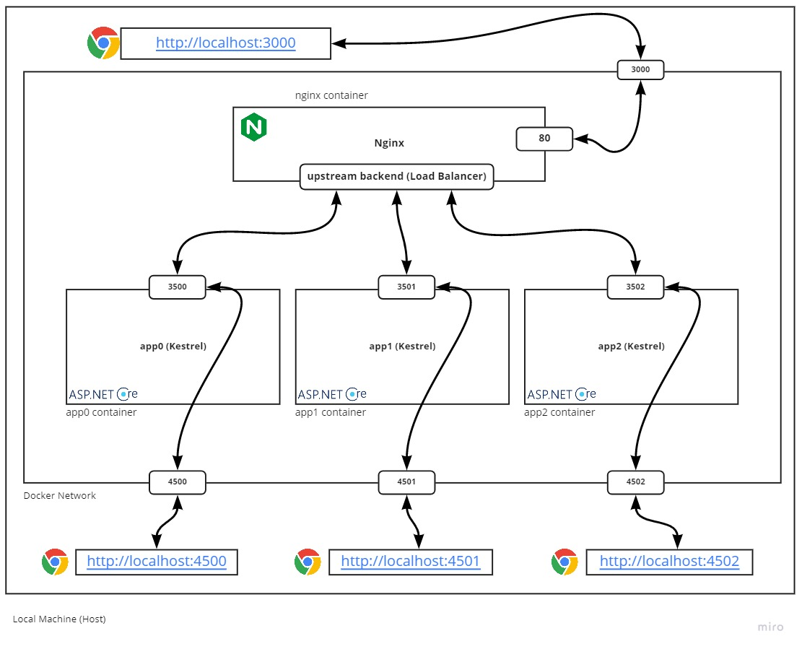

In the [previous blog post](/setup-reverse-proxy-server-using-nginx-aspnetcore-and-docker-part1/), we talked about Reverse Proxy Web Servers. But in this post, we will go through implementing load balancing for our Nginx web server.

### Load Balancing
Load balancing helps to distribute incoming load into multiple web servers. It helps to have maximum throughput, utilize resource usage, reduce latency, and ensures the solution is fault-tolerant.

Let's go back  to the `reverse-proxy-sample` from the previous blog post and change the `docker-compose.yml` file to this:

```yml
version: '3.4'
services:
  app0:
    hostname: 'app0'
    build:
      context: ./app
    ports:
      - "4500:3500"
    environment:
      - ASPNETCORE_URLS=http://+:3500
  app1:
    hostname: 'app1'
    build:
      context: ./app
    ports:
      - "4501:3501"
    environment:
      - ASPNETCORE_URLS=http://+:3501
  app2:
    hostname: 'app2'
    build:
      context: ./app
    ports:
      - "4502:3502"
    environment:
      - ASPNETCORE_URLS=http://+:3502
  nginx:
    build: 
      context: ./nginx
    ports:
      - "3000:80"

```

Here instead of having one instance, we build three instances of the same application. 

*Warning: Creating multiple instances of the same app like this is not recommended for production use and is just for simplicity. Consider using solutions like Kubernetes in real-world scenarios for better performance, maintenance, and control over instances.*

Now we need to configure the Nginx service to distribute incoming requests to them. Open the `default.conf` and change it to this:
```nginx
upstream backend {
    server app0:3500;
    server app1:3501;
    server app2:3502;
}

server {
    listen       80;
    listen  [::]:80;
    server_name  localhost;

    location / {
       proxy_pass   http://backend;
    }
}
```

These changes configure Nginx to re-route every incoming request into one of the specified servers.

In order to be able to see the number of incoming requests to each server, let's implement a counter. Open the `HomeController.cs` file and make the following changes to the `Index` method:
```csharp
private static int _counter = 0;

public IActionResult Index()
{
    ViewData["Counter"] = ++_counter;
    ViewData["AppName"] = Environment.GetEnvironmentVariable("HOSTNAME");
    
    return View();
}
```
And in the `Index.cshtml` file:
```html
<div class="text-center">
    <h1 class="display-4">Welcome</h1>
    <p>Instance: @ViewData["AppName"]</p>
    <p>Counter: @ViewData["Counter"]</p>
</div>
```
Now every instance of the application shows the number of served requests. 

Run the docker-compose again using `docker-compose up` and when it got ready, open the [http://localhost:3000](http://localhost:3000) and hit refresh multiple times. You should see the counter number increases almost evenly between all instances.

Do you want to see what happens when one of the applications goes down? Try stopping one of them by running this:
```sh
# You can see list of running containers by running:
# docker ps
docker stop reverse-proxy-sample_app0_1
```
And keep refreshing the application. You won't notice a change. That's because the Nginx detects the failure and never route any request toward the broken instance. In a real-world scenario, where each application instance is hosted on a different machine when an unexpected failure happens (like hardware or network failure), imagine how helpful it is that the load balancer handles the situation.

 By the way, you can still open the app instances directly at [http://localhost:4500](http://localhost:4500), [http://localhost:4501](http://localhost:4501) and [http://localhost:4502](http://localhost:4502).


The diagram below shows the whole picture:

*The Nginx Load Balancer*

Nginx, by default, uses the RoundRobin algorithm. This model distributes requests evenly among available servers. There are other algorithms like Least Connection and IP Hash. To try them, read the [Nginx HTTP Load Balancing Docs](https://docs.nginx.com/nginx/admin-guide/load-balancer/http-load-balancer/#choosing-a-load-balancing-method){:target="_blank"}.

I hope you find this blog post useful. Have a happy coding day! 