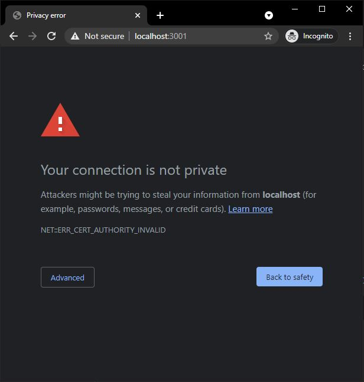

In the [previous blog post](/setup-reverse-proxy-server-using-nginx-aspnetcore-and-docker-part2-load-balancing/), we talked about Load balancing in the Reverse Proxy Web Servers. But in this post, we will go through implementing SSL encryption for our reverse proxy web server.

### Web Acceleration
Reverse Proxy Servers can perform operations like data compression, caching, and SSL encryption that otherwise should be handle in all application instances in the upstream network.

In the next example, we will create a self signed certificate and configure the Nginx server to enable SSL encryption.

To generate keys and create a valid certificate, install OpenSSL. On windows, you can install it using Chocolatey:
```sh
choco install openssl
``` 
Or download binaries and add them to your system path.

Back to the `nginx` directory and create an `ssl` folder. 
```sh
cd nginx && mkdir ssl
```
Now let's generate the private key and certificate:
```sh
openssl req -x509 -nodes -days 365 -addext "subjectAltName=DNS:localhost" -newkey rsa:2048 -keyout "./ssl/selfsigned.key" -out "./ssl/selfsigned.crt"
```
It will ask you some questions about Country, State, City, Company, etc. Just remember to enter `localhost` when it asks about `Common Name (e.g. server FQDN or YOUR name)`. After entering them you will be ended up with two files: `selfsigned.cert` which is the certificate file and `selfsigned.key` that is the private key file.

Now we need to configure the Nginx to use our SSL certificate. In the `default.conf` make the following changes:
 ```nginx
 upstream backend {
    server app0:3500;
    server app1:3501;
    server app2:3502;
}

server {
    listen       80;
    listen  [::]:80;
    server_name  localhost;

    # New changes:
    listen 443 ssl http2 default_server;
    listen [::]:443 ssl http2 default_server;
    ssl_certificate /etc/ssl/certs/selfsigned.crt;
    ssl_certificate_key /etc/ssl/private/selfsigned.key;
    # End of new changes:
    
    location / {
       proxy_pass   http://backend;
    }
}
 ```
Ok, now Nginx will read the certificate and private key files from the specified locations in the container. We need to update Nginx `Dockerfile` to copy these files into the expected locations:
 ```Dockerfile
 FROM nginx:1.19.9

COPY ./config/default.conf /etc/nginx/conf.d/default.conf

# Copy Cert and Key files into configured locations
COPY ./ssl/selfsigned.crt /etc/ssl/certs/selfsigned.crt
COPY ./ssl/selfsigned.key /etc/ssl/private/selfsigned.key
 ```

If the docker-compose is still running, stop it using `docker-compose down --rmi=all`. This will delete all containes and images created in the previous step.

And one last thing! HTTPS protocol runs on port 443. So we need to add it to the `docker-compose.yml` file. In the `nginx` service section, under `- "3000:80"` make this change:
```yml
  nginx:
    build: 
      context: ./nginx
    ports:
      - "3000:80"
      - "3001:443" # The new port mapping for HTTPS
```
Then run it again:
```
docker-compose up
```
Now if you navigate to [https://localhost:3001](https://localhost:3001) BAM! You see a warning:


Well, since the certificate is self-signed, the Host OS (in this case, Windows 10) doesn't trust it by default. We need to introduce it to the host system explicitly.

To do this, run the following command in the Windows Powershell:
```ps
Import-Certificate -FilePath "C:\Projects\Github\reverse-proxy-sample\nginx\ssl\selfsigned.crt" -CertStoreLocation cert:\CurrentUser\Root
```
Path to the `.crt` file in your system is different. Make sure you update it before running the command. Also, before installing the certificate, a warning dialog will be shown that you need to confirm it.

After installing the self signed certificate successfully, open [https://localhost:3001](https://localhost:3001) again and you should see secured lock icon in the Google Chrome address bar. 

*NOTE: If you're using Mozilla Firefox, you might still see the warning! To fix it, you need to manually import the certificate into Firefox Certificates from Options > Privacy & Security.*